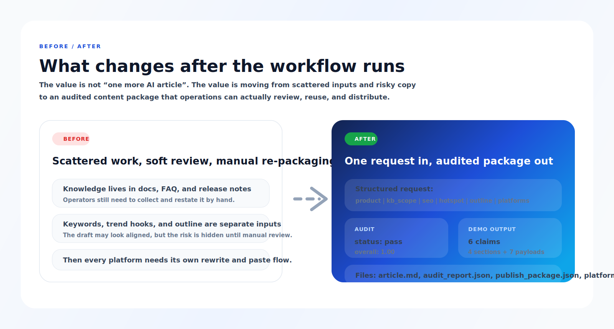

# IP Publisher

<p align="right"><a href="./README.md">简体中文</a> | <strong>English</strong></p>

<p align="center"></p>

<p align="center">
  <a href="https://github.com/veeicwgy/ip-publisher/stargazers"></a>
  <a href="https://github.com/veeicwgy/ip-publisher/releases"></a>
  <a href="./LICENSE"></a>
  <a href="https://clawhub.ai/veeicwgy/ip-publisher"></a>
</p>

> Turn product documentation, knowledge-base facts, SEO keywords, trend hooks, and an outline into **audited articles + 7-platform publish packs** before any publishing step.

<p align="center">
  <a href="https://clawhub.ai/veeicwgy/ip-publisher"><strong>👉 Install from ClawHub</strong></a> ·
  <a href="./data/tasks/demo-request.json">Demo Request</a> ·
  <a href="./data/kb_raw/mineru-overview.md">Demo KB</a> ·
  <a href="./docs/platform-support.md">Platform Matrix</a> ·
  <a href="./docs/publish-package.md">Publish Package Contract</a>
</p>

<p align="center">
  <code>KB-first</code> ·
  <code>Audit-gated</code> ·
  <code>7-platform bundle</code> ·
  <code>Wechatsync-ready</code>
</p>

<p align="center">
  
</p>

## Why teams try it

<table>
  <tr>
    <td width="25%" valign="top"><strong>Knowledge-base first</strong><br>It starts from docs, FAQ, and release notes instead of an empty prompt.</td>
    <td width="25%" valign="top"><strong>Audit before publish</strong><br>Accuracy, keyword fit, structure, and platform rules are checked before packaging content.</td>
    <td width="25%" valign="top"><strong>One topic, many channels</strong><br>The same source topic is adapted into the canonical 7-platform bundle by default.</td>
    <td width="25%" valign="top"><strong>Built for operators</strong><br>It returns a draft, an audit report, a publish package, and draft-sync hints instead of raw copy alone.</td>
  </tr>
</table>

## Traditional workflow vs IP Publisher

| Traditional workflow | IP Publisher |
| --- | --- |
| Keywords, trends, and source material live in separate places | KB docs, keywords, trends, and outline are normalized into one structured request |
| Generate first and hope manual review catches problems | Audit gate comes before publish packaging |
| Every channel needs manual rewriting | The canonical 7-platform bundle is generated by default |
| Output often looks like generic AI rewriting | Technical content leans toward Q&amp;A, tables, heading hierarchy, and entity labels |
| Operators receive copy only and must rebuild the rest | Operators receive `article.md`, `audit_report.json`, `publish_package.json`, and platform files |

## 30-second overview

| You provide | The workflow does | You get back |
| --- | --- | --- |
| Product/tool KB docs, primary keywords, trend hooks, outline brief, audience | Generates from the KB, audits grounding/keyword fit/structure/platform rules, then adapts the same core piece into 7 platform payloads | `article.md`, `audit_report.json`, `publish_package.json`, and `platforms/*.md` |

<table>
  <tr>
    <td width="50%" align="center"></td>
    <td width="50%" align="center"></td>
  </tr>
  <tr>
    <td align="center"><strong>Inputs</strong><br>KB docs, keywords, trend hooks, and outline brief</td>
    <td align="center"><strong>Outputs</strong><br>Draft, publish package, and platform files</td>
  </tr>
  <tr>
    <td width="50%" align="center"></td>
    <td width="50%" align="center"></td>
  </tr>
  <tr>
    <td align="center"><strong>Audit report</strong><br>Grounding, keyword fit, structure, and platform gates</td>
    <td align="center"><strong>7 platform payloads</strong><br>One source topic adapted into the canonical bundle</td>
  </tr>
</table>

```text
outputs/<task_id>/
  article.md
  audit_report.json
  publish_package.json
  platforms/
    wechat_official.md
    xiaohongshu.md
    zhihu.md
    juejin.md
    csdn.md
    toutiao.md
    weibo.md
```

## See a real before / after

<p align="center">
  
</p>

This example comes directly from the bundled repo demo:

- Request: [data/tasks/demo-request.json](./data/tasks/demo-request.json)
- Output: [outputs/phase1-demo-mineru/article.md](./outputs/phase1-demo-mineru/article.md) and [outputs/phase1-demo-mineru/audit_report.json](./outputs/phase1-demo-mineru/audit_report.json)
- Current demo audit result: `pass` with all four scores at `1.0`

## Why this is not just another AI rewriter

- It starts from a **knowledge base**, not an empty prompt.
- It runs an **audit gate** before packaging content for distribution.
- It defaults to a **canonical 7-platform bundle**, not an inconsistent 3-platform vs. 29-platform story.
- It is **draft-sync first** through [Wechatsync](https://github.com/wechatsync/Wechatsync), not a username/password autopublisher.
- For technical content it explicitly optimizes for `Q&A`, comparison tables, clear heading hierarchy, entity labels, and reproducible code examples.

## Who this is for

- Product, SEO, and knowledge-base content teams
- Operators who need one source topic adapted into WeChat, Xiaohongshu, Zhihu, Juejin, CSDN, Toutiao, and Weibo
- Teams that want accuracy and auditability before adding publishing automation

## Where it fits best

- Turning product docs and KB content into AI-friendly and SEO-ready article systems
- Combining a trend hook with product knowledge into a reviewable draft
- Splitting one technical topic into WeChat, Zhihu, Juejin, CSDN, Xiaohongshu, Toutiao, and Weibo versions
- Giving operations teammates a lower-friction workflow with audit gates instead of auto-post risk

## What it does now

IP Publisher now centers on one production path:

1. Retrieve facts from a product/tool knowledge base
2. Combine them with SEO keywords, trend hooks, and an outline brief
3. Generate an AI-friendly article structure
4. Audit grounding, keyword coverage, structure quality, fact density, and platform limits
5. Export 7 platform payloads plus a publish package and Wechatsync draft-sync metadata

The default canonical bundle is:

- `wechat_official`
- `xiaohongshu`
- `zhihu`
- `juejin`
- `csdn`
- `toutiao`
- `weibo`

## Quick start

```bash
git clone https://github.com/veeicwgy/ip-publisher.git
cd ip-publisher
bash scripts/setup.sh
python3 scripts/quickstart.py
```

The new quickstart asks for:

- product/tool name
- primary keywords
- trend/topic hook
- outline brief
- target audience
- content type (`general` or `technical`)

It no longer asks “which platform?” as the main question. One topic now defaults to the 7-platform bundle.

Useful demo inputs:

- [Demo KB overview](./data/kb_raw/mineru-overview.md)
- [Demo KB FAQ](./data/kb_raw/mineru-faq.json)
- [Demo request](./data/tasks/demo-request.json)

## Outputs

After a run you will get:

- `request.json`
- `draft.json`
- `audit_report.json`
- `publish_package.json`
- `article.md`
- `platforms/*.md`

## Direct publishing stance

This repo does not do username/password login automation.

The recommended publishing bridge is [Wechatsync](https://github.com/wechatsync/Wechatsync):

- browser-login based
- draft-first
- same web APIs as the platform editors
- only after `audit_report.status == pass`

## Humanizer

The repo now includes a lightweight built-in humanizer step inspired by [Humanizer-zh](https://github.com/op7418/Humanizer-zh). It focuses on reducing template-like AI phrasing while preserving facts.

## Docs

- [Platform matrix](./docs/platform-support.md)
- [Publish package contract](./docs/publish-package.md)
- [Phase 1 scaffold](./docs/phase1-scaffold.md)

## License

MIT
