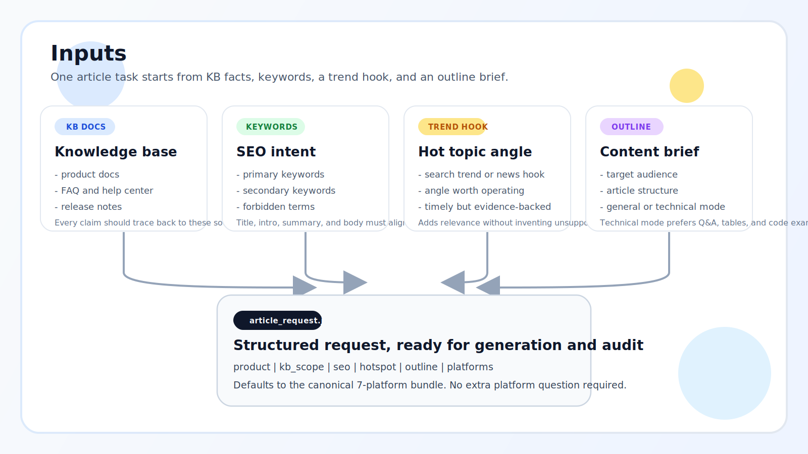
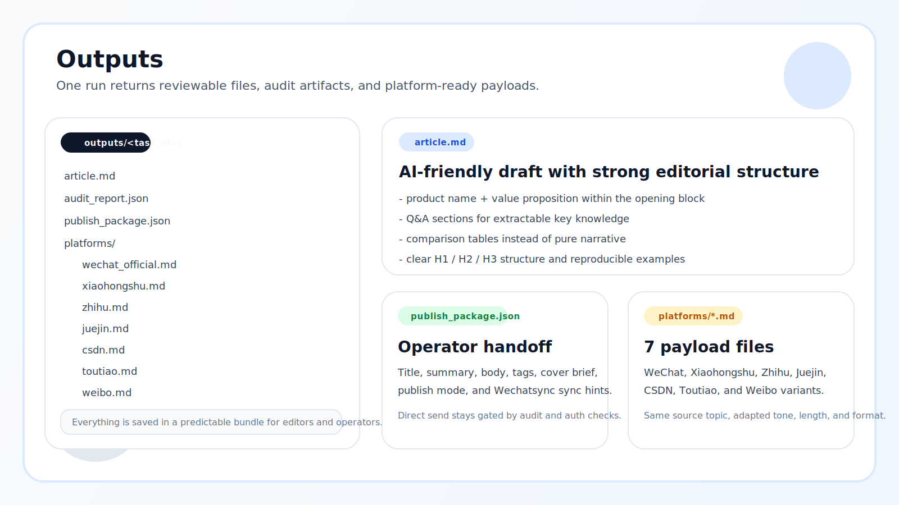
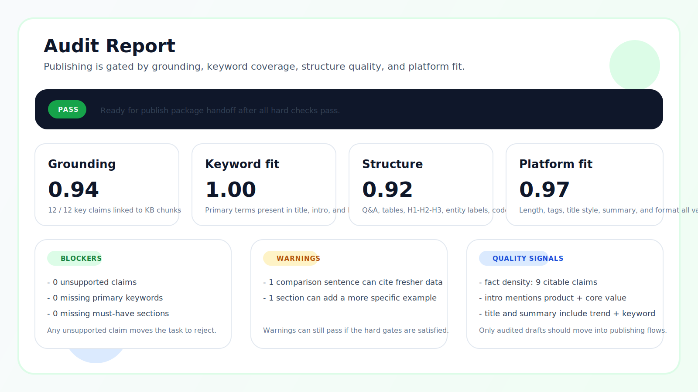
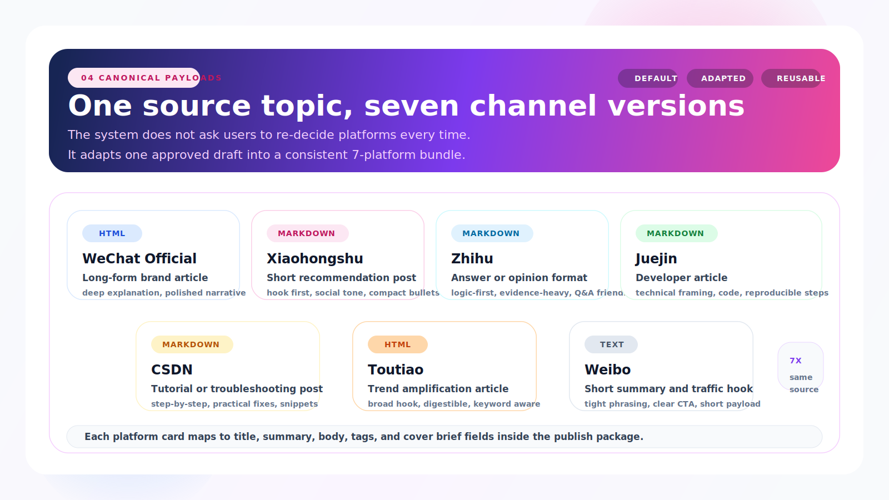

# IP Publisher

<p align="right"><strong>简体中文</strong> | <a href="./README.en.md">English</a></p>

<p align="center"></p>

<p align="center">
  <a href="https://github.com/veeicwgy/ip-publisher/stargazers"></a>
  <a href="https://github.com/veeicwgy/ip-publisher/releases"></a>
  <a href="./LICENSE"></a>
  <a href="https://clawhub.ai/veeicwgy/ip-publisher"></a>
</p>

> 把 **产品/工具知识库 + SEO 关键词 + 热点线索 + 大纲**，变成一套 **先审核、再分发** 的内容工作流：主稿、`audit_report.json`、`publish_package.json` 和 **7 平台 payload** 一次产出。

<p align="center">
  <a href="https://clawhub.ai/veeicwgy/ip-publisher"><strong>👉 Install from ClawHub</strong></a> ·
  <a href="https://github.com/veeicwgy/ip-publisher">GitHub 仓库</a> ·
  <a href="./data/tasks/demo-request.json">Demo Request</a> ·
  <a href="./data/kb_raw/mineru-overview.md">Demo KB</a> ·
  <a href="./docs/platform-support.md">平台矩阵</a> ·
  <a href="./docs/publish-package.md">发布包定义</a>
</p>

---

## 30 秒看懂

| 你提供什么 | 系统做什么 | 你拿到什么 |
| --- | --- | --- |
| 产品/工具知识库、主关键词、热点线索、大纲、受众 | 基于知识库生成主稿，审核事实准确性/关键词命中/结构完整性/平台格式，再拆成 7 平台版本 | `article.md`、`audit_report.json`、`publish_package.json`、`platforms/*.md` |

<table>
  <tr>
    <td width="50%" align="center"></td>
    <td width="50%" align="center"></td>
  </tr>
  <tr>
    <td align="center"><strong>输入</strong><br>知识库、关键词、热点线索、大纲</td>
    <td align="center"><strong>输出</strong><br>主稿、发布包、平台内容文件</td>
  </tr>
  <tr>
    <td width="50%" align="center"></td>
    <td width="50%" align="center"></td>
  </tr>
  <tr>
    <td align="center"><strong>审核报告</strong><br>准确性、关键词、结构、平台规则闸门</td>
    <td align="center"><strong>7 平台 payload</strong><br>同一主题拆成 canonical 7 平台版本</td>
  </tr>
</table>

```text
outputs/<task_id>/
  article.md
  audit_report.json
  publish_package.json
  platforms/
    wechat_official.md
    xiaohongshu.md
    zhihu.md
    juejin.md
    csdn.md
    toutiao.md
    weibo.md
```

## 为什么不是普通 AI 改写器

- 它从 **知识库** 出发，不是从空白 prompt 出发。
- 它先做 **审核**，再产出可分发的发布包，不是“生成完就发”。
- 它默认是 **canonical 7 平台 bundle**，不是一会儿 3 个平台、一会儿 29 个平台。
- 它默认走 **Wechatsync 草稿同步说明**，不是账号密码直登发布器。
- 它对技术内容有明确结构要求：`Q&A`、对比表格、`H1 -> H2 -> H3`、实体标注、代码示例。

## 适合谁

- 做产品内容、SEO 内容、知识库运营的团队
- 需要同一主题拆出微信公众号 / 小红书 / 知乎 / 掘金 / CSDN / 头条 / 微博版本的运营同学
- 希望先把准确率和审核门槛做好，再考虑自动化分发的团队

## 快速开始

```bash
git clone https://github.com/veeicwgy/ip-publisher.git
cd ip-publisher
bash scripts/setup.sh
python3 scripts/quickstart.py
```

Quickstart 现在问的是：

```text
产品或工具名
需要运营的主关键词
热点线索 / 选题描述
大纲描述
主要读者
内容类型（general / technical）
```

它不会再默认追问“目标平台是什么”。默认就是 7 平台 bundle，一次生成多平台 payload。

如果你想先看一套可复现的输入格式：

- 示例知识库：[data/kb_raw/mineru-overview.md](./data/kb_raw/mineru-overview.md)
- 示例 FAQ：[data/kb_raw/mineru-faq.json](./data/kb_raw/mineru-faq.json)
- 示例请求：[data/tasks/demo-request.json](./data/tasks/demo-request.json)

默认不托管账号密码，也不直接伪装成“已发布成功”。默认停在 **审核通过后的发布包 / Wechatsync 草稿同步信息**。

---

## Canonical 7 平台

仓库默认支持的标准平台包固定为 7 个：

| 平台 ID | 平台名 | 适合的内容 | 默认格式 | 默认发布方式 |
| --- | --- | --- | --- | --- |
| `wechat_official` | 微信公众号 | 品牌长文、深度说明 | `html` | `Wechatsync` 草稿同步 |
| `xiaohongshu` | 小红书 | 推荐型短内容、经验帖 | `markdown` | `Wechatsync` 草稿同步 |
| `zhihu` | 知乎 | 问答型、观点型长文 | `markdown` | `Wechatsync` 草稿同步 |
| `juejin` | 掘金 | 技术实践、开发者文章 | `markdown` | `Wechatsync` 草稿同步 |
| `csdn` | CSDN | 教程、排障、技术帖子 | `markdown` | `Wechatsync` 草稿同步 |
| `toutiao` | 头条号 | 热点扩写、泛流量文章 | `html` | `Wechatsync` 草稿同步 |
| `weibo` | 微博 | 短摘要、导流文案 | `text` | `Wechatsync` 草稿同步 |

为什么是这 7 个，而不是 README 里一会儿 3 个一会儿 29 个：

- 这是仓库的 **canonical bundle**，面向当前最常见的中文内容分发与技术内容场景。
- 它们同时覆盖品牌长文、问答、技术社区、热点扩写和短摘要导流。
- 这 7 个都能对应到 Wechatsync 适配器，门槛最低。
- Wechatsync 虽然支持 29+ 平台，但仓库默认不把 29+ 全部塞进 quickstart，避免第一次使用过重。

详细矩阵见 [docs/platform-support.md](./docs/platform-support.md)。

---

## 发布包到底包含什么

Phase 1 生成完成后，会在 `outputs/<task_id>/` 里输出：

| 文件 | 作用 |
| --- | --- |
| `request.json` | 本次任务输入：知识库范围、关键词、热点、大纲、平台、发布模式 |
| `draft.json` | 主稿、声明、结构信号、平台 payload、发布包元信息 |
| `audit_report.json` | 准确性、关键词、结构、事实密度、平台规则审核结果 |
| `publish_package.json` | 运营真正关心的发布包定义 |
| `article.md` | 适合编辑和运营直接审阅的 Markdown 主稿 |
| `platforms/*.md` | 每个平台可直接复制或交给 Wechatsync 的内容文件 |

`publish_package.json` 里会明确写：

- 是否已经通过审核门槛
- 每个平台的 `title / summary / body / tags / cover brief`
- 是否支持直发
- 如果走 Wechatsync，对应的 CLI 示例命令是什么

详细说明见 [docs/publish-package.md](./docs/publish-package.md)。

---

## 直发怎么做

当前仓库的直发口径很明确：

- 默认只输出 `direct_publish_ready` 信息，不直接自动登录
- 默认推荐 [Wechatsync](https://github.com/wechatsync/Wechatsync)
- Wechatsync 依赖浏览器里现成的登录态和平台 Web API，同步默认进草稿
- 只有 `audit_report.status == pass` 才应该进入同步

也就是说，这一版不是“账号密码发文器”，而是“审核通过后可进入草稿同步”的内容工作流。

---

## Quickstart 已经换成知识库驱动逻辑

它不会再默认追问“目标平台是什么”。  
默认就是 7 平台 bundle，一次生成多平台 payload。

如果你要技术文，可以把 `content_type` 设成 `technical`，系统会要求：

- Q&A 组织关键知识点
- 开头 100 字内出现产品名 + 核心价值主张
- 使用对比表格而不是纯叙述
- H1 → H2 → H3 层级清晰
- 明确实体标注
- 给出可复现代码示例

---

## 审核通过的标准

只有同时满足下面几类条件，才算审核通过：

- 关键声明可以回溯到知识库 chunk
- 主关键词命中标题、简介、正文
- 热点词至少出现在标题、简介或正文之一
- Q&A、对比表格、实体标注、H1/H2/H3 结构齐全
- 事实密度和可引用声明数达到门槛
- 每个平台版本满足长度和格式限制

`audit_report.json` 现在会输出：

- `grounding`
- `keyword_fit`
- `outline_fit`
- `platform_fit`
- `ai_structure`
- `fact_density`
- `authority_signal`

以及：

- `citable_claims`
- `fact_density`
- `authority_signal_count`
- `primary_keywords_in_title`
- `primary_keywords_in_summary`
- `hotspot_hit`
- `platforms_ready`

---

## Humanizer 现在怎么接

仓库内已经加入一个轻量 humanizer 阶段，参考 [Humanizer-zh](https://github.com/op7418/Humanizer-zh) 的思路，先做三件事：

- 去掉常见 AI 套话
- 打散过于整齐的段落节奏
- 保留事实不变，只做表达自然化

这一步现在是仓库内置轻量版，目的是降低首次使用门槛。后续如果要进一步接入完整的 Humanizer-zh 工作流，可以继续把它升级成可插拔模块。

---

## 当前主入口与 legacy 入口

| 入口 | 现在的定位 |
| --- | --- |
| `python3 scripts/quickstart.py` | 主入口，知识库驱动生成 + 审核 + 7 平台发布包 |
| `python3 -m ip_publisher.cli.run_phase1 --request ...` | 结构化接口，适合接系统或 ClawHub |
| `scripts/generate-publish-pack.py` | legacy template mode，保留给旧的模板化改写场景 |

---

## 仓库结构

```text
ip_publisher/
  kb/          文档加载、切块、检索
  planner/     关键词、热点、大纲
  generator/   主稿生成、humanize、平台 payload
  auditor/     grounding、关键词、结构、质量、平台审核
  publisher/   发布包与 Wechatsync 直发桥接信息
  workflows/   Phase 1 主流程
data/
  kb_raw/      示例知识库
  tasks/       示例 request
docs/
  platform-support.md
  publish-package.md
  phase1-scaffold.md
```

---

## License

本项目采用 [MIT License](LICENSE)。
