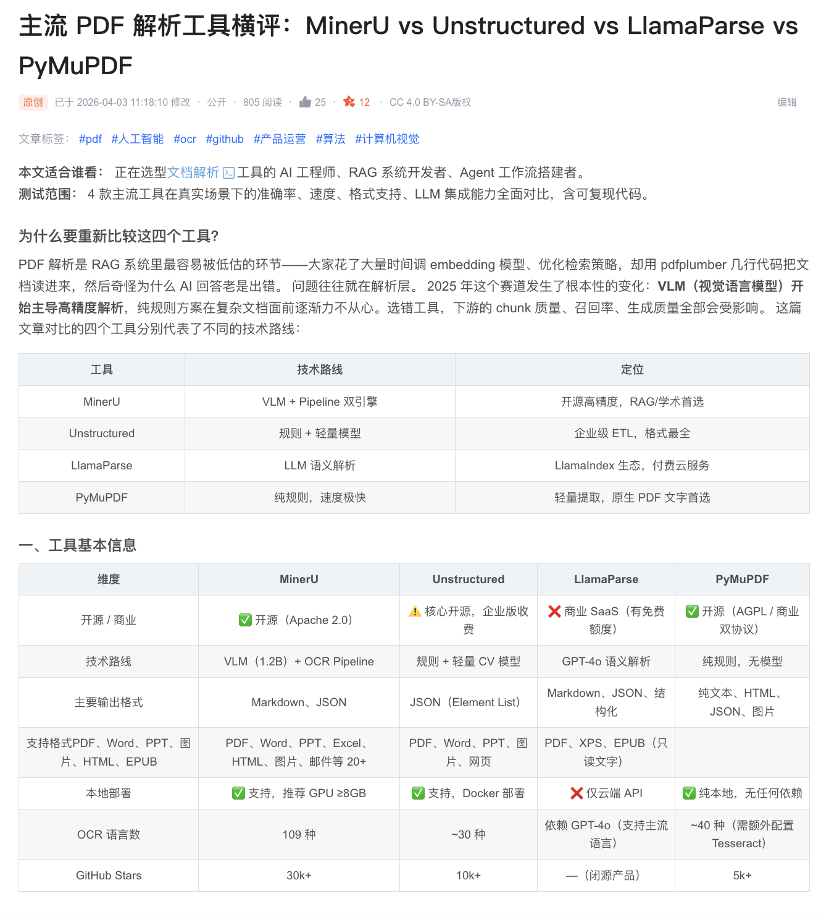

# IP Publisher

<p align="center"></p>

> 面向个人 IP 运营者的全流程 AI 内容自动化工具
> 从「热点发现」到「手动发布包输出」，一条命令跑通内容生产链路。

[](LICENSE)
[](https://github.com/veeicwgy/ip-publisher/stargazers)
[](https://github.com/veeicwgy/ip-publisher/network/members)

> 如果这个项目对你有帮助，欢迎先点一个 **Star**。这会直接帮助我判断是否优先补齐平台 API 自动发布、更多封面模板和更完整的内容工作流。

---

## 这个项目解决什么问题

个人创作者做内容，最耗时间的不是“写字”，而是：

- 选题慢：每天不知道写什么
- 多平台改写重复劳动：小红书、知乎、公众号风格不同
- AI 味重：读起来像模板
- 发布链路碎片化：封面、正文、分发各一套工具

**IP Publisher** 把这些步骤串成一个可执行工作流：
`热点 -> 人设对齐 -> 平台改写 -> 去 AI 味 -> 封面生成 -> 手动发布包输出`

---

## 30 秒看效果

### 真实输出示例

下面这张图就是一次真实生成后的文章效果示例。你只需要给出一句需求，仓库里的工作流就会继续完成热点筛选、人设对齐、正文生成、去 AI 味和封面准备，最后产出适合复制发布的内容结果。

<p align="center"></p>

---

## 3 分钟跑通（MVP）

### 1) 克隆仓库

```bash
git clone https://github.com/veeicwgy/ip-publisher.git
cd ip-publisher
```

### 2) 安装依赖并初始化配置

```bash
bash scripts/setup.sh
```

### 3) 直接触发主流程

对 Claude Code 或 OpenClaw 说：

```text
帮我写一篇小红书文章
```

---

## 它会自动完成什么

| 步骤 | 动作 | 结果 |
| --- | --- | --- |
| 1 | 加载或创建 IP 人设 | 明确职业、风格、受众、禁忌话题 |
| 2 | 抓取实时热点 | 直接抓取微博、知乎、36 氪等公开热点源 |
| 3 | 生成内容策略 | 输出标题方向、核心观点、情绪目标 |
| 4 | 适配目标平台 | 生成小红书、知乎、公众号等平台文案 |
| 5 | 去 AI 味处理 | 减少模板感，注入个人表达风格 |
| 6 | 生成封面 | 调用真实 AI 生图能力输出封面 |
| 7 | 输出发布包 | 生成可直接复制到各平台的内容与状态说明 |

---

## 支持哪些平台

| 平台 | 适合内容 | 是否支持封面 |
| --- | --- | --- |
| 小红书 | 情绪化表达、图文种草 | 是 |
| 知乎 | 观点分析、长文回答 | 是 |
| 微信公众号 | 叙事型长文、品牌沉淀 | 是 |
| CSDN | 技术教程、复盘文章 | 是 |
| 微博 | 热点短评、互动表达 | 否 |
| 今日头条 | 热点扩写、大众议题 | 是 |
| 掘金 | 技术实操、工程总结 | 是 |

---

## 5 个常用触发词

```text
帮我写一篇关于 AI 趋势的小红书文章
基于今天的热点写一篇公众号推文
设置我的 IP 人设
给我看看今天适合我的热点
给我输出一份知乎和公众号可直接复制的发布版本
```

---

## 为什么这个仓库更适合个人 IP

它不是单点写作工具，而是一条围绕个人 IP 运营设计的完整链路。核心思路不是“生成一篇文章”，而是先对齐你是谁、适合写什么、平台应该怎么改，再把最后一步的封面与发布准备也串起来。

---

## 核心能力与依赖

| 能力 / 依赖 | 作用 |
| --- | --- |
| Agent 搜索与网页抓取 | 直接抓取微博、知乎、36 氪热点，无需额外 Python 包 |
| Wechatsync | 多平台同步与发布的插件依赖，当前版本仍需用户侧手动配合 |
| miaoda_image_generate | 真实 AI 封面生成 |
| Humanizer-zh | 中文去 AI 味处理 |

---

## 当前状态与后续计划

| 方向 | 当前状态 | 后续计划 |
| --- | --- | --- |
| 热点抓取 | 已改为直接使用网页搜索与抓取能力 | 增加更多垂直站点源 |
| 去 AI 味 | 已有规则化处理流程 | 增加效果评估与反馈回路 |
| 封面生成 | 已升级为真实生图能力 | 增加更多模板与批量生成能力 |
| 发布交付 | 当前输出标准格式文章与封面，便于手动发布 | 后续接入平台 API 实现自动发布 |

---

## License

本项目采用 [MIT License](LICENSE)。

## Star History

[](https://star-history.com/#veeicwgy/ip-publisher&Date)
