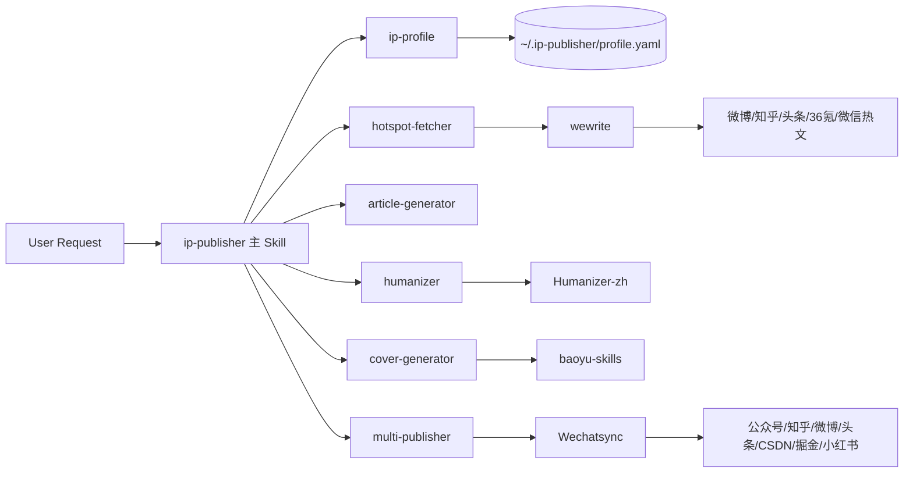

# Integration Map

## 总览

`ip-publisher` 不是重新发明热点、封面和发布能力，而是把多个上游开源项目编排成一条面向个人 IP 运营者的内容生产链路。

## 集成关系图



## 数据流向

| 阶段 | 输入 | 输出 | 责任模块 |
| --- | --- | --- | --- |
| 人设初始化 | 用户自我描述 | `profile.yaml` | `ip-profile` |
| 热点抓取 | 人设领域 | Top 10 热点 | `hotspot-fetcher` + `wewrite` |
| 内容策略 | 热点 + 人设 | 标题方向、观点、情绪 | `ip-publisher` |
| 内容生成 | 平台 + 话题 + 人设 | 文章草稿 | `article-generator` |
| 去 AI 味 | 文章草稿 + 语气样本 | 人性化正文 | `humanizer` + `Humanizer-zh` |
| 封面生成 | 标题 + 平台 + 风格 | 封面方案 | `cover-generator` + `baoyu-skills` |
| 发布 | 文章 + 封面 + 平台 | 状态报告 | `multi-publisher` + `Wechatsync` |

## 上游仓库职责

| 仓库 | 具体职责 | 在本项目中的集成方式 |
| --- | --- | --- |
| `wewrite` | 抓取与聚合多平台热点 | 由 `hotspot-fetcher` 调用其热点模块 |
| `Humanizer-zh` | 中文去 AI 味处理 | 由 `humanizer` 读取并加工生成稿 |
| `baoyu-skills` | 封面生成相关 Skill 思路与封装 | 由 `cover-generator` 生成平台封面任务 |
| `Wechatsync` | 多平台同步与发布 | 由 `multi-publisher` 承接最终发布 |

## 安装依赖关系

```text
setup.sh
 ├─ install-deps.py
 ├─ clone wewrite
 ├─ clone Humanizer-zh
 ├─ clone baoyu-skills
 ├─ clone Wechatsync
 ├─ install skills to Claude/OpenClaw directories
 └─ initialize ~/.ip-publisher/profile.yaml
```
